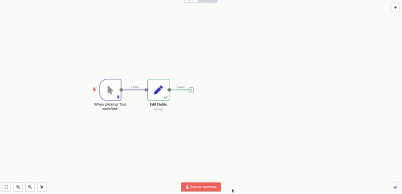

# n8n Datastore Node

An n8n node that provides a simple in-memory key-value store. This node is useful for temporarily sharing data between different workflow executions or different parts of the same workflow, as long as they are running within the **same n8n instance and process**. At the moment supports only in-memory store.

It is no-code solution for [getWorkflowStaticData](https://docs.n8n.io/code/cookbook/builtin/get-workflow-static-data/) where you practically required to write JavaScript and you overall lose declarative approach of your workflows.

## Feature demo

## Key Features

*   **Set Value:** Store a string or JSON object associated with a unique key.
*   **Get Value:** Retrieve a stored value using its key.
*   **Clear Value:** Remove a specific key-value pair from the store.
*   **Clear All:** Remove all key-value pairs from the store.
*   Configurable output for Set/Clear operations (pass through input or output status).

## Prerequisites

*   An active n8n instance.

## Installation

If this node is not part of the core n8n nodes, follow these steps to install it as a community node:

 - Go to "Settings" -> "Community nodes"
 - Click "Install"
 - Enter "n8n-nodes-datastore"
 - Ack security risks and proceed with the installation

Later on you will find this node under the name "Datastore" in the modes search box.

## Important Considerations & Limitations

 - **In-Memory Storage**: All data stored using this node resides in the RAM of the n8n process. If n8n is restarted, all data in this store will be lost.
 - **Single Process Scope**: If you are running n8n in a scaled environment with multiple worker processes, this in-memory store will not be shared between these workers. Each worker process will have its own isolated instance of the Datastore.memoryStore. This node is most effective when n8n is running as a single process.
 - **Memory Consumption**: Storing very large amounts of data or a very large number of keys can consume significant server memory. Use with caution for large datasets.
 - **Use Cases: Best suited for**:
   - Temporary data sharing within a single, complex workflow execution.
   - Passing small pieces of information between different workflow executions if n8n is running as a single process and restarts are infrequent.
   - Simple caching mechanisms where data loss on restart is acceptable.
 - **Not a Database Replacement**: For persistent storage, reliable inter-process communication, or robust data management, use a proper database (e.g., PostgreSQL, MySQL, Redis) with its corresponding n8n node.

## License

[MIT](https://github.com/n8n-io/n8n-nodes-starter/blob/master/LICENSE.md)
