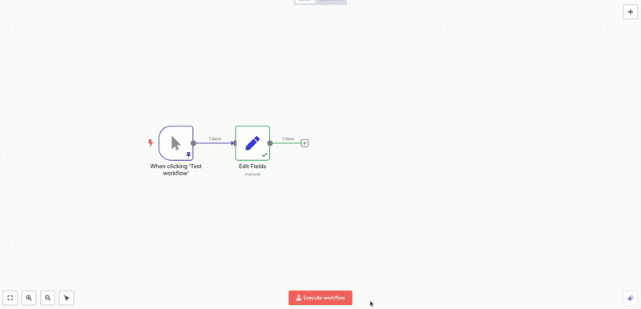
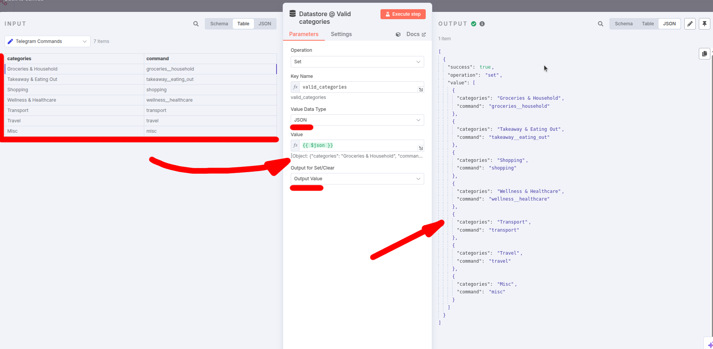

# n8n Datastore Node

An n8n node that provides a simple in-memory key-value store. This node is useful for temporarily sharing data between different workflow executions or different parts of the same workflow.

It is no-code solution for `getWorkflowStaticData()`, Complex round-robin ping-pong via S3 or any similar approach where you tried to achieve any kind of pseudo persistence in your workflows, where you practically required to write JavaScript or integrate complex chains of nodes together in your workflows.

## Feature demo

## Key Features

*   **Set Value:** Store a string or JSON object associated with a unique key.
*   **Get Value:** Retrieve a stored value using its key.
*   **Clear Value:** Remove a specific key-value pair from the store.
*   **Clear All:** Remove all key-value pairs from the store.
*   Configurable output for Set/Clear operations (pass through input or output status).

## Prerequisites

*   An active n8n instance.

## Installation

If this node is not part of the core n8n nodes, follow these steps to install it as a community node:

 - Go to "Settings" -> "Community nodes"
 - Click "Install"
 - Enter "n8n-nodes-datastore"
 - Ack security risks and proceed with the installation

Later on you will find this node under the name "Datastore" in the modes search box.

## Addressed issues

- [Keep variables between executions](https://community.n8n.io/t/keep-variables-between-executions/5595)
- [How to store data as global variable?](https://community.n8n.io/t/how-to-store-data-as-global-variable/27125)
- [Store values between Executions](https://community.n8n.io/t/store-values-between-executions/23959)
- [How to store variables based on dynamic data, for use throughout workflow](https://community.n8n.io/t/how-to-store-variables-based-on-dynamic-data-for-use-throughout-workflow/68826/4)
- [Best way to store global variable in n8n community edition](https://www.reddit.com/r/n8n/comments/1gptv3c/best_way_to_store_global_variable_in_n8n/)
- [Community edition environments and variables](https://www.reddit.com/r/n8n/comments/18cz4f8/community_edition_environments_and_variables/)
- [Set a value and update each time the workflow runs](https://community.n8n.io/t/set-a-value-and-update-each-time-the-workflow-runs/35083)
- [How can I share a variable between two workflows in n8n?](https://community.n8n.io/t/how-can-i-share-a-variable-between-two-workflows-in-n8n/102094)
- ... :D

## FAQ

 - How to reference all input values (table data, JSON-array) and save it into specified key?
   - You have to Select type `Value Data Type` = `JSON` and in `Value` make expression something like `{{ $json }}`. See the screenshot below:
     

How to store entire input as JSON

     

## Important Considerations & Limitations

 - **In-Memory Storage**: All data stored using this node resides in the RAM of the n8n process. If n8n is restarted, all data in this store will be lost.
 - **Memory Consumption**: Storing very large amounts of data or a very large number of keys can consume significant server memory. Use with caution for large datasets.
 - **Not a Database Replacement**: For persistent storage, reliable inter-process communication, or robust data management, use a proper database (e.g., PostgreSQL, MySQL, Redis) with its corresponding n8n node.

## License

[MIT](https://github.com/n8n-io/n8n-nodes-starter/blob/master/LICENSE.md)
